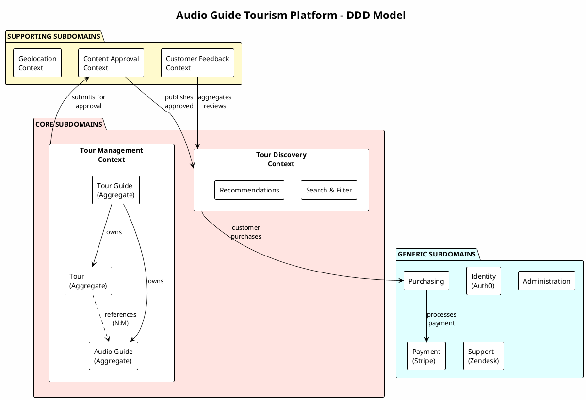

### Question:
Summarize the Subdomains, the Bounded Context and the Aggregate roots  in a text format and an image format that I can print

### Audio Guide Tourism Platform - DDD Summary

---

### Subdomains Overview

#### 🔴 CORE Subdomains (Competitive Advantage)

| Subdomain | Description | Investment |
|-----------|-------------|------------|
| **Tour Management** | Creating and managing Tours, Tour Points, Audio Guides, and Tour Guide profiles | Build in-house, high investment |
| **Tour Discovery & Search** | Finding tours based on filters (language, topic, duration, accessibility, reviews) | Build in-house, high investment |

#### 🟡 SUPPORTING Subdomains (Necessary but Not Differentiating)

| Subdomain | Description | Investment |
|-----------|-------------|------------|
| **Content Approval** | Approval workflows for Tours and Audio Guides (automatic + manual) | Build simple or buy |
| **Tour Guide Management** | Tour Guide profiles, portfolios, ratings | Build simple |
| **Customer Feedback** | Reviews, ratings, likes | Build simple |
| **Geolocation Management** | Coordinate validation, mapping integration | Integrate with external APIs |

#### ⚪ GENERIC Subdomains (Commodity)

| Subdomain | Description | Investment |
|-----------|-------------|------------|
| **Identity & Access Management** | Authentication, authorization | Buy (Auth0, Keycloak) |
| **E-Commerce / Purchasing** | Shopping cart, orders, entitlements | Build simple or buy |
| **Payment Processing** | Payment transactions | Buy (Stripe, PayPal) |
| **Customer Support** | Support tickets | Buy (Zendesk, Freshdesk) |
| **Administration** | Reference data management | Build simple CRUD |
| **Finance & Reporting** | Revenue tracking, reports | Build or buy |

---

### Bounded Contexts

| Context | Subdomains Included | Key Responsibility |
|---------|---------------------|-------------------|
| **Tour Management Context** | Tour Management | CRUD for Tours, Tour Points, Audio Guides |
| **Content Approval Context** | Content Approval | Approval workflows and rules |
| **Tour Discovery Context** | Tour Discovery & Search | Search, filtering, recommendations |
| **Customer Context** | Customer Feedback, Purchasing | Customer profiles, reviews, purchases |
| **Payment Context** | Payment Processing | External payment integration |
| **Identity Context** | Identity & Access Management | Authentication & authorization |
| **Administration Context** | Administration | Reference data management |

---

### Aggregate Roots

#### Tour Management Context

| Aggregate Root | Entities | Value Objects |
|----------------|----------|---------------|
| **Tour** | Tour Points | Tour Location, Tour Price, Tour Point Location, Tour Point Photos, Audio Guide References (IDs) |
| **Audio Guide** | — | Language, Topic, Age Group, Duration, Accessibility Tags, Audio File Reference, Approval Status |
| **Tour Guide** | — | Profile Information, Contact Details |

#### Key Relationships
- **Tour ↔ Audio Guide**: Many-to-Many (via Tour Points referencing Audio Guide IDs)
- **Tour Guide → Tour**: One-to-Many (Tour Guide owns Tours)
- **Tour Guide → Audio Guide**: One-to-Many (Tour Guide owns Audio Guides)
- **Constraint**: Audio Guide can only be linked to Tours owned by the same Tour Guide

---

### Text Diagram (Copy-Paste Friendly)

```
╔══════════════════════════════════════════════════════════════════════════════╗
║                    AUDIO GUIDE TOURISM PLATFORM - DDD MODEL                  ║
╠══════════════════════════════════════════════════════════════════════════════╣
║                                                                              ║
║  ┌─────────────────────────────────────────────────────────────────────┐    ║
║  │                     TOUR MANAGEMENT CONTEXT                          │    ║
║  │                         (CORE SUBDOMAIN)                             │    ║
║  │  ┌─────────────────┐  ┌─────────────────┐  ┌─────────────────┐     │    ║
║  │  │   TOUR GUIDE    │  │      TOUR       │  │   AUDIO GUIDE   │     │    ║
║  │  │   (Aggregate)   │  │   (Aggregate)   │  │   (Aggregate)   │     │    ║
║  │  ├─────────────────┤  ├─────────────────┤  ├─────────────────┤     │    ║
║  │  │ • Profile       │  │ • Tour Location │  │ • Language      │     │    ║
║  │  │ • Contact       │  │ • Tour Price    │  │ • Topic         │     │    ║
║  │  │                 │  │ • Tour Points   │  │ • Age Group     │     │    ║
║  │  │     owns ───────┼──┤   └─ Location   │  │ • Duration      │     │    ║
║  │  │                 │  │   └─ Photos     │  │ • Accessibility │     │    ║
║  │  │     owns ───────┼──┼───────────────────►│ • Audio File    │     │    ║
║  │  │                 │  │   └─ AudioGuide │  │ • Approval      │     │    ║
║  │  │                 │  │      Refs (IDs) │  │   Status        │     │    ║
║  │  └─────────────────┘  └─────────────────┘  └─────────────────┘     │    ║
║  │                              N:M relationship                        │    ║
║  └─────────────────────────────────────────────────────────────────────┘    ║
║                                      │                                       ║
║                                      ▼                                       ║
║  ┌─────────────────────────────────────────────────────────────────────┐    ║
║  │                   CONTENT APPROVAL CONTEXT                           │    ║
║  │                     (SUPPORTING SUBDOMAIN)                           │    ║
║  │  • Tour Approval Workflow                                            │    ║
║  │  • Audio Guide Approval Workflow (independent rules)                 │    ║
║  │  • Approval Rules Engine                                             │    ║
║  └─────────────────────────────────────────────────────────────────────┘    ║
║                                      │                                       ║
║                                      ▼                                       ║
║  ┌─────────────────────────────────────────────────────────────────────┐    ║
║  │                    TOUR DISCOVERY CONTEXT                            │    ║
║  │                       (CORE SUBDOMAIN)                               │    ║
║  │  • Search & Filtering                                                │    ║
║  │  • Recommendations                                                   │    ║
║  │  • Reviews Aggregation                                               │    ║
║  └─────────────────────────────────────────────────────────────────────┘    ║
║                                      │                                       ║
║          ┌───────────────────────────┴───────────────────────┐              ║
║          ▼                                                   ▼              ║
║  ┌───────────────────┐                           ┌───────────────────┐      ║
║  │ CUSTOMER CONTEXT  │                           │ PURCHASING CONTEXT│      ║
║  │   (SUPPORTING)    │                           │    (GENERIC)      │      ║
║  │ • Customer Profile│                           │ • Shopping Cart   │      ║
║  │ • Reviews/Ratings │                           │ • Orders          │      ║
║  │ • Preferences     │                           │ • Entitlements    │      ║
║  └───────────────────┘                           └─────────┬─────────┘      ║
║                                                            │                 ║
║                                                            ▼                 ║
║                                                  ┌───────────────────┐      ║
║                                                  │  PAYMENT CONTEXT  │      ║
║                                                  │    (GENERIC)      │      ║
║                                                  │ • Stripe/PayPal   │      ║
║                                                  └───────────────────┘      ║
║                                                                              ║
║  ┌───────────────────┐  ┌───────────────────┐  ┌───────────────────┐       ║
║  │ IDENTITY CONTEXT  │  │  ADMIN CONTEXT    │  │ SUPPORT CONTEXT   │       ║
║  │    (GENERIC)      │  │    (GENERIC)      │  │    (GENERIC)      │       ║
║  │ • Auth0/Keycloak  │  │ • Reference Data  │  │ • Zendesk         │       ║
║  │ • Roles/Perms     │  │ • CRUD Admin UI   │  │ • Tickets         │       ║
║  └───────────────────┘  └───────────────────┘  └───────────────────┘       ║
║                                                                              ║
╚══════════════════════════════════════════════════════════════════════════════╝
```

---

### Aggregate Roots Detail Diagram

```
╔══════════════════════════════════════════════════════════════════════════════╗
║                         AGGREGATE ROOTS - DETAILED VIEW                      ║
╠══════════════════════════════════════════════════════════════════════════════╣
║                                                                              ║
║  ┌────────────────────────────────────────────────────────────────────────┐ ║
║  │ TOUR GUIDE (Aggregate Root)                                            │ ║
║  │ ══════════════════════════                                             │ ║
║  │ Identity: TourGuideId (UUID)                                           │ ║
║  │                                                                        │ ║
║  │ Value Objects:                                                         │ ║
║  │   • Profile (name, bio, photo)                                         │ ║
║  │   • ContactInfo (email, phone)                                         │ ║
║  │   • Rating (average, count)                                            │ ║
║  │                                                                        │ ║
║  │ References:                                                            │ ║
║  │   • List<TourId> (tours owned)                                         │ ║
║  │   • List<AudioGuideId> (audio guides owned)                            │ ║
║  └────────────────────────────────────────────────────────────────────────┘ ║
║                          │ owns                    │ owns                    ║
║                          ▼                         ▼                         ║
║  ┌──────────────────────────────────┐  ┌──────────────────────────────────┐ ║
║  │ TOUR (Aggregate Root)            │  │ AUDIO GUIDE (Aggregate Root)     │ ║
║  │ ═════════════════════            │  │ ═════════════════════════════    │ ║
║  │ Identity: TourId (UUID)          │  │ Identity: AudioGuideId (UUID)    │ ║
║  │                                  │  │                                  │ ║
║  │ Value Objects:                   │  │ Value Objects:                   │ ║
║  │   • TourLocation (lat, lng, addr)│  │   • Language (code, name)        │ ║
║  │   • TourPrice (amount, currency) │  │   • Topic (id, name)             │ ║
║  │   • ApprovalStatus               │  │   • AgeGroup (id, range)         │ ║
║  │                                  │  │   • Duration (minutes)           │ ║
║  │ Entities:                        │  │   • AccessibilityTags (list)     │ ║
║  │   • TourPoints (ordered list)    │  │   • AudioFileRef (url, format)   │ ║
║  │     ├─ TourPointId               │  │   • ApprovalStatus               │ ║
║  │     ├─ Location (lat, lng)       │  │                                  │ ║
║  │     ├─ Photos (list of urls)     │  │ Invariants:                      │ ║
║  │     └─ AudioGuideRefs (list)─────┼──┼─► Must be approved before use    │ ║
║  │                                  │  │   in published Tour              │ ║
║  │ Invariants:                      │  │                                  │ ║
║  │   • All TourPoints must have     │  └──────────────────────────────────┘ ║
║  │     at least 1 AudioGuide ref    │                                       ║
║  │   • Can only ref AudioGuides     │                                       ║
║  │     owned by same TourGuide      │                                       ║
║  └──────────────────────────────────┘                                       ║
║                                                                              ║
║  ═══════════════════════════════════════════════════════════════════════════ ║
║  LEGEND:                                                                     ║
║    • Aggregate Root = Consistency boundary, accessed via Repository          ║
║    • Entity = Has identity, lifecycle within aggregate                       ║
║    • Value Object = Immutable, no identity, compared by value                ║
║    • Reference = ID only, not embedded object (eventual consistency)         ║
╚══════════════════════════════════════════════════════════════════════════════╝
```

---

### Domain Events

```
╔══════════════════════════════════════════════════════════════════════════════╗
║                              DOMAIN EVENTS                                   ║
╠══════════════════════════════════════════════════════════════════════════════╣
║                                                                              ║
║  Tour Management Context:              Content Approval Context:             ║
║  ─────────────────────────             ─────────────────────────             ║
║  • TourCreated                         • TourSubmittedForApproval            ║
║  • TourPointAdded                      • TourApproved                        ║
║  • TourPointRemoved                    • TourRejected                        ║
║  • AudioGuideLinkedToTourPoint         • AudioGuideSubmittedForApproval      ║
║  • AudioGuideUnlinkedFromTourPoint     • AudioGuideApproved                  ║
║  • TourPublished                       • AudioGuideRejected                  ║
║  • TourUnpublished                                                           ║
║  • AudioGuideCreated                   Customer Context:                     ║
║  • AudioGuideUpdated                   ─────────────────                     ║
║                                        • ReviewSubmitted                     ║
║  Purchasing Context:                   • RatingGiven                         ║
║  ───────────────────                   • TourLiked                           ║
║  • TourAddedToCart                                                           ║
║  • TourPurchased                                                             ║
║  • TourDownloaded                                                            ║
║                                                                              ║
╚══════════════════════════════════════════════════════════════════════════════╝
```

---

### Printable Summary Card

```
┏━━━━━━━━━━━━━━━━━━━━━━━━━━━━━━━━━━━━━━━━━━━━━━━━━━━━━━━━━━━━━━━━━━━━━━━━━━━━┓
┃           AUDIO GUIDE TOURISM PLATFORM - DDD QUICK REFERENCE               ┃
┣━━━━━━━━━━━━━━━━━━━━━━━━━━━━━━━━━━━━━━━━━━━━━━━━━━━━━━━━━━━━━━━━━━━━━━━━━━━━┫
┃                                                                            ┃
┃  CORE (Build & Invest)          SUPPORTING (Build Simple)                  ┃
┃  ─────────────────────          ─────────────────────────                  ┃
┃  • Tour Management              • Content Approval                         ┃
┃  • Tour Discovery               • Tour Guide Management                    ┃
┃                                 • Customer Feedback                        ┃
┃                                 • Geolocation                              ┃
┃                                                                            ┃
┃  GENERIC (Buy/Outsource)        AGGREGATE ROOTS                            ┃
┃  ───────────────────────        ─────────────────                          ┃
┃  • Identity (Auth0)             • Tour Guide                               ┃
┃  • Payment (Stripe)             • Tour                                     ┃
┃  • Support (Zendesk)            • Audio Guide                              ┃
┃  • E-Commerce                                                              ┃
┃  • Administration               KEY RELATIONSHIP                           ┃
┃  • Finance                      ────────────────                           ┃
┃                                 Tour ←N:M→ Audio Guide                     ┃
┃                                 (via Tour Point references)                ┃
┃                                                                            ┃
┗━━━━━━━━━━━━━━━━━━━━━━━━━━━━━━━━━━━━━━━━━━━━━━━━━━━━━━━━━━━━━━━━━━━━━━━━━━━━┛
```

---

### For Image Format

To create a professional image, you can:

1. **Use draw.io (diagrams.net)** - Free, export to PNG/PDF
2. **Use Miro** - Collaborative whiteboard
3. **Use Lucidchart** - Professional diagrams
4. **Use PlantUML** - Code-based diagrams

Here's a **PlantUML code** you can paste into [plantuml.com](https://www.plantuml.com/plantuml/uml/) to generate an image:



Copy this code to [plantuml.com](https://www.plantuml.com/plantuml/uml/) and download the PNG/SVG image for printing.